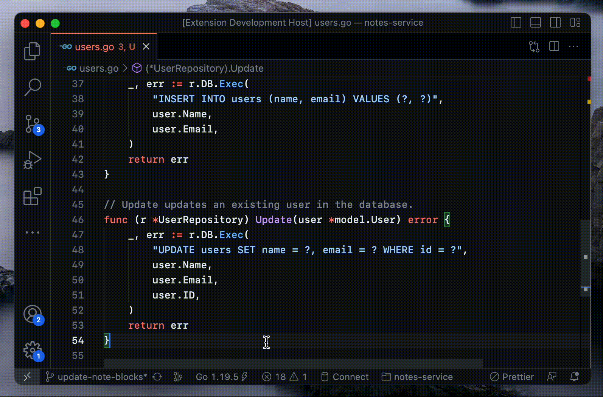
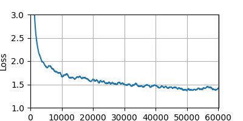

# 🤖 Gopilot - AI-Assitant for Golang

     


GoPilot is a **290M parameters** language model trained exclusively on **Go code** using a **small research budget** (~100$).

<p align="center">
  
</p>
<p align="center"><i>Demo of the Gopilot <a href="https://github.com/rojas-diego/gopilot-vscode-ext">VSCode Code Extension</a></i></p>

<p align="center"><b><a href="https://github.com/rojas-diego">⭐️ Diego Rojas</a></b> <b><a style="margin-left:16px" href="https://github.com/LeowWB">⭐️ Wenbin Leow</a></b> <b><a style="margin-left:16px" href="https://github.com/jy477274">⭐️ Jayden Macdonald</a></b>  <b><a style="margin-left:16px" href="https://github.com/Stanislas0">⭐️ Qinkai Zheng</a></b></p>

## Overview

Gopilot is a GPT-style Transformer model trained on **20B tokens** on a **single RTX4090 for less than a week** using the Go split of [The Stack Dedup v1.2](https://www.google.com/search?client=safari&rls=en&q=the+stack+dedup+v1.2&ie=UTF-8&oe=UTF-8) dataset. It comes in two flavours: a HuggingFace tokenizer based model and a model based on a custom Go tokenizer that we developed.

<p align="center">
  
</p>

The pre-training and fine-tuning weights are made available [here](https://gopilot.s3.ap-east-1.amazonaws.com).

```
aws s3 ls s3://gopilot/checkpoints/ --region ap-east-1
```

## Installation

You need to have `conda` and `go` installed on your machine. You can install the necessary dependencies using `conda` and the provided `environment_cpu.yml` (choose `environment_cuda.yml` when running CUDA). Dependencies may not be up to date, hence, using the official [Docker image](https://hub.docker.com/r/rojasdiego/gopilot) is preferred.

Build the Go tokenizer binary:

```bash
# Linux, MacOS
go build -o tokenizer/libgotok.so -buildmode=c-shared ./tokenizer/libgotok.go
# Windows
go build -o tokenizer/libgotok.dll -buildmode=c-shared ./tokenizer/libgotok.go
```

## Usage

A CUDA Docker image is made available [here](https://hub.docker.com/r/rojasdiego/gopilot).

### Pre-Training

The pre-training script trains the model for the specified token budget. Expects a pre-tokenized dataset.

```bash
python train.py \
        --model-cf model/config/gopilot-290M.yml \
        --tokenizer hugging-face \
        --tokenizer-cf tokenizer/config/hugging-face.json \
        --s3-dataset-prefix <prefix-of-your-s3-dataset> \
        --s3-bucket <your-s3-bucket> \
        --gradient-accumulation-steps 64 \
        --optimizer sophiag \
        --batch-size 8 \
        --lr 0.0005 \
        --token-budget 10000000000 \
        --device cuda \
        --precision fp16 \
        --s3-checkpoints \
        --warmup 1000 \
        --neptune \
        --compile
```

### Fine-tuning

You can fine-tune Gopilot on any JSONL dataset composed of samples of the following form: `{"sample": "package main\nconst Value = 1..."}`. We use a mix of pre-training samples, AI-generated samples to perform finetuning.

```bash
python finetune.py \
    --model-cf model/config/gopilot-290M.yml \
    --tokenizer-cf tokenizer/config/hugging-face.json \
    --tokenizer hugging-face \
    --in-model-weights checkpoints/hugging-face.pt \
    --out-model-weights checkpoints/hugging-face-ft.pt \
    --dataset-filepath all \
    --gradient-accumulation-steps 16 \
    --batch-size 8 \
    --dropout 0.1 \
    --weight-decay 0.1 \
    --lr 0.000025 \
    --num-epochs 10 \
    --precision fp16 \
    --neptune
```

### Evaluation

The evaluation script runs evaluation on the HumanEvalX benchmark. Our best model obtains **7.4% `pass@10`** and **77.1% compile@10**. Check out the `results` folder for more information.

```bash
python evaluate.py \
    --model-cf model/config/gopilot-290M.yml \
    --tokenizer-cf tokenizer/config/gopilot.json \
    --tokenizer gopilot \
    --model-weights /checkpoints/gopilot-ft.pt \
    --device cuda \
    --k 10 \
    --max-new-tokens 128 \
    --verbose
```

### Inference Server

The inference server is a simple HTTP server that hosts the model and exposes a `/complete` endpoint to submit samples to auto-complete. It's used by the VSCode extension to provide completions.

```bash
python inference_server.py \
    --model-cf model/config/gopilot-290M.yml \
    --tokenizer-cf tokenizer/config/gopilot.json \
    --tokenizer gopilot \
    --device mps \
    --checkpoint-path .cache/checkpoints/gopilot-ft.pt
```

### VSCode Extension

Check out the Gopilot VSCode extension [here](https://github.com/rojas-diego/gopilot-vscode-ext). Works with the inference server.

## Acknowledgements & Notes

- **Thank you to Qinkai Zheng** for providing guidance and the hardware resources.
- We did not check for leakage when performing HumanEvalX evaluation. **Do not include these results in research**.
- This project was made during the course of **Deep Learning (80240743-0) at Tsinghua University**.
- While fun to play around with, we do not recommend using a model of this size for code completion in your editor. It's a school project!
- Feel free to use the code, tweak the checkpoints, and all!

## Future Work

- [ ] Release the model weights on HuggingFace
- [ ] Quantize the model weights for fast inference
- [ ] Interactive online demo
- [ ] Try on other languages such as Rust or C++
- [ ] Experiment with different tokenization strategies
- [ ] Train for longer on more data
